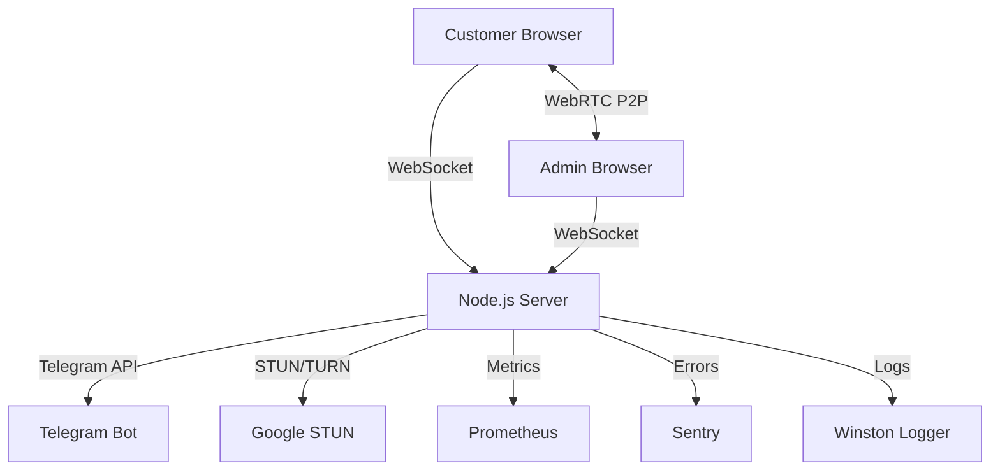
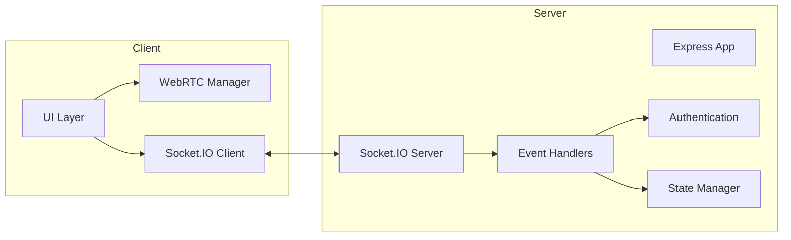
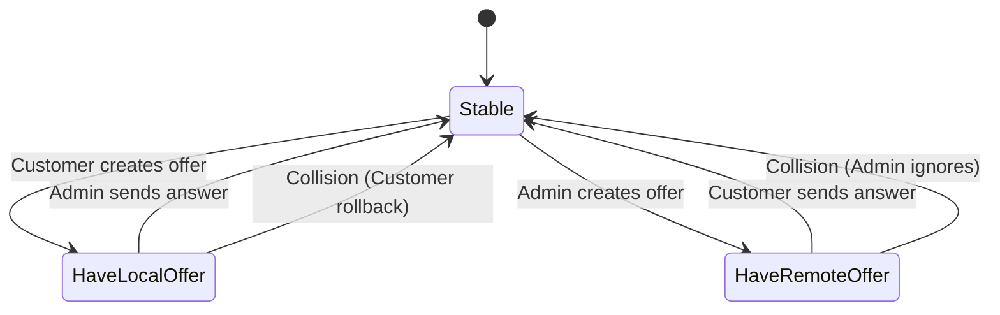
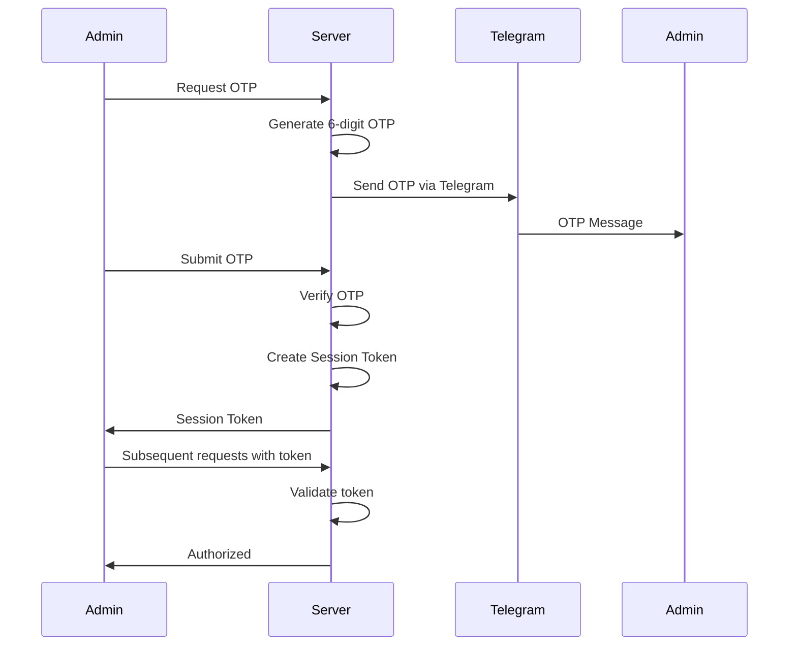
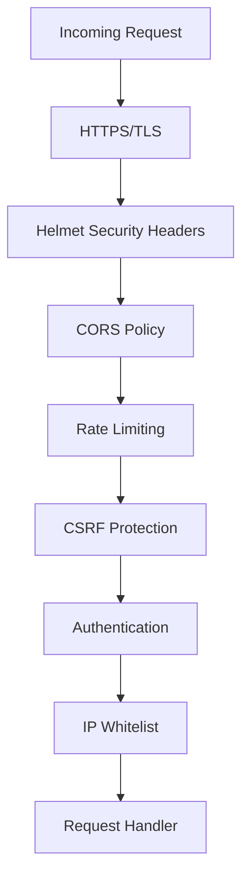
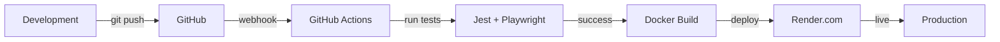

# Architecture Documentation

## System Overview



## Component Architecture



## WebRTC Flow

```mermaid
sequenceDiagram
    participant C as Customer
    participant S as Server
    participant A as Admin
    
    C->>S: Connect WebSocket
    A->>S: Connect WebSocket
    
    C->>S: Join Room
    A->>S: Join Room (OTP Auth)
    
    S->>C: room:user:joined (admin)
    S->>A: room:user:joined (customer)
    
    C->>C: Create Peer Connection
    A->>A: Create Peer Connection
    
    C->>S: rtc:description (offer)
    S->>A: rtc:description (offer)
    
    A->>S: rtc:description (answer)
    S->>C: rtc:description (answer)
    
    C->>S: rtc:ice-candidate
    S->>A: rtc:ice-candidate
    
    A->>S: rtc:ice-candidate
    S->>C: rtc:ice-candidate
    
    C<-->A: WebRTC P2P Connection
```

## Perfect Negotiation Pattern



## Authentication Flow



## State Management

```mermaid
graph TD
    State[State Manager] --> Admin[adminSocket]
    State --> Customers[customerSockets Map]
    State --> Channel[channelStatus]
    State --> OTP[otpStore Map]
    State --> Sessions[sessionStore Map]
    
    Admin --> |null/Socket| AdminConn[Admin Connection]
    Customers --> |socketId: Socket| CustomerConn[Customer Connections]
    Channel --> |AVAILABLE/BUSY| Status[Channel Status]
    OTP --> |socketId: {otp, expires}| OTPData[OTP Data]
    Sessions --> |token: {socketId, expires}| SessionData[Session Data]
```

## Directory Structure

```
ALO/
├── public/              # Static files
│   ├── css/            # Stylesheets
│   ├── js/             # Client-side JavaScript
│   └── icons/          # Icons and images
├── socket/             # Socket.IO handlers
│   ├── handlers.js     # Room & WebRTC handlers
│   ├── admin-auth.js   # Admin authentication
│   └── otp.js          # OTP generation
├── utils/              # Utilities
│   ├── logger.js       # Winston logger
│   ├── metrics.js      # Prometheus metrics
│   ├── auth.js         # Session management
│   ├── rate-limiter.js # Rate limiting
│   ├── middleware.js   # Custom middleware
│   └── sentry.js       # Error tracking
├── routes/             # Express routes
├── tests/              # Test suites
│   ├── unit/          # Unit tests
│   ├── integration/   # Integration tests
│   └── e2e/           # E2E tests
└── docs/              # Documentation
```

## Technology Stack

### Backend
- **Runtime**: Node.js 18+
- **Framework**: Express.js
- **WebSocket**: Socket.IO
- **Logger**: Winston
- **Metrics**: Prometheus (prom-client)
- **Security**: Helmet, CORS, Rate Limiting
- **Error Tracking**: Sentry

### Frontend
- **WebRTC**: Native WebRTC API
- **UI**: Vanilla JavaScript
- **CSS**: Custom CSS (Mobile-first)
- **PWA**: Service Worker, Manifest

### Testing
- **Unit/Integration**: Jest
- **E2E**: Playwright
- **Coverage**: Istanbul (via Jest)

### DevOps
- **CI/CD**: GitHub Actions
- **Container**: Docker
- **Hosting**: Render.com
- **Monitoring**: Sentry, Prometheus

## Security Layers



## Scaling Strategy

### Current (Single Instance)
- In-memory state
- Single server
- 0-500 users/day

### Future (Multi-Instance)
- Redis for state
- Load balancer
- Horizontal scaling
- 500+ users/day

## Performance Optimizations

1. **WebSocket Compression**: Level 9, threshold 0
2. **Static File Caching**: Cache-Control headers
3. **Gzip Compression**: Express compression
4. **Connection Pooling**: Socket.IO connection reuse
5. **Perfect Negotiation**: Minimal signaling overhead

## Monitoring & Observability

- **Metrics**: `/metrics` endpoint (Prometheus format)
- **Health Check**: `/health` endpoint
- **Logs**: Winston (file + console)
- **Error Tracking**: Sentry
- **Uptime**: Render.com health checks

## Deployment Pipeline



## Future Enhancements

1. Redis cache for multi-instance support
2. PostgreSQL for call history
3. Admin dashboard with analytics
4. Multi-language support (i18n)
5. Advanced monitoring (New Relic/DataDog)
