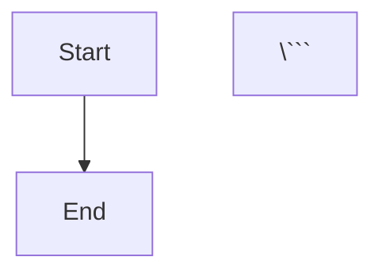

# AdminAra Architecture Documentation

## 📊 Architecture Diagrams

All diagrams are in Mermaid format and can be viewed on GitHub or using Mermaid Live Editor.

### System Architecture


**View**: [system-architecture.mmd](diagrams/system-architecture.mmd)

Shows the complete system architecture with:
- Client Layer (Customer + Admin browsers)
- Application Layer (WebSocket, REST API, Auth)
- Business Layer (Queue, WebRTC, Monitoring)
- Data Layer (Redis, State Store)
- External Services (TURN, Telegram, Sentry)

---

### WebRTC Call Flow


**View**: [webrtc-flow.mmd](diagrams/webrtc-flow.mmd)

Sequence diagram showing:
- WebSocket connection establishment
- Room join (customer + admin)
- WebRTC negotiation (Perfect Negotiation Pattern)
- ICE candidate exchange
- P2P vs TURN relay decision
- Call termination

---

### Authentication Sequence


**View**: [authentication-sequence.mmd](diagrams/authentication-sequence.mmd)

Admin authentication flow:
- OTP request via Telegram
- OTP verification (max 5 attempts)
- JWT session creation (httpOnly cookie)
- Session validation
- Logout and session revocation

---

### Deployment Diagram


**View**: [deployment-diagram.mmd](diagrams/deployment-diagram.mmd)

Production deployment on Render.com:
- Web Service (Node.js, 512MB RAM)
- Optional Redis (paid tier)
- External services (TURN, Telegram, Sentry)
- Client connections (web + mobile)
- Monitoring (Prometheus + Grafana)

---

### Data Flow


**View**: [data-flow.mmd](diagrams/data-flow.mmd)

Customer and admin user flows:
- Customer: Visit → Queue → Call → End
- Admin: Login → OTP → Accept → Call → End → Next
- Data storage: Sessions, Queue, Metrics

---

## 🔧 How to View Diagrams

### Option 1: GitHub (Recommended)
GitHub automatically renders Mermaid diagrams. Just view the `.mmd` files on GitHub.

### Option 2: Mermaid Live Editor
1. Go to https://mermaid.live
2. Copy diagram content from `.mmd` file
3. Paste into editor
4. View rendered diagram

### Option 3: VS Code Extension
1. Install "Markdown Preview Mermaid Support" extension
2. Open `.mmd` file
3. Press `Ctrl+Shift+V` (Windows) or `Cmd+Shift+V` (Mac)

### Option 4: Embed in Markdown
```markdown


---

## 📚 Related Documentation

- [README.md](../README.md) - Quick start guide
- [FULL-DOCUMENTATION.md](../FULL-DOCUMENTATION.md) - Complete documentation
- [SOCKET-API.md](../SOCKET-API.md) - Socket.IO events
- [MOBILE-COMPATIBILITY.md](../MOBILE-COMPATIBILITY.md) - Mobile support
- [BACKUP-STRATEGY.md](../BACKUP-STRATEGY.md) - Backup & DR
- [API Documentation](https://adminara.onrender.com/api-docs) - Swagger UI

---

## 🎯 Key Architectural Decisions

### 1. Perfect Negotiation Pattern
- Eliminates glare conditions
- Polite/impolite peer roles
- Automatic renegotiation

### 2. In-Memory Fallbacks
- Redis optional (Render free tier)
- Queue: Array-based fallback
- Sessions: Map-based fallback
- State: In-memory store

### 3. Security First
- httpOnly cookies (XSS protection)
- CSRF protection (production)
- Rate limiting (DDoS protection)
- Input validation (Joi schemas)
- PII masking (logs)

### 4. Mobile Optimization
- Adaptive bitrate (300kbps-1.5Mbps)
- Battery monitoring (<20% threshold)
- Connection quality monitoring
- PWA support

### 5. Monitoring & Observability
- Prometheus metrics
- Sentry error tracking
- Business metrics (call duration, satisfaction)
- Health checks (/health, /ready)

---

**Last Updated**: 2024
**Version**: 1.3.8
**Production Ready**: 99.8%
